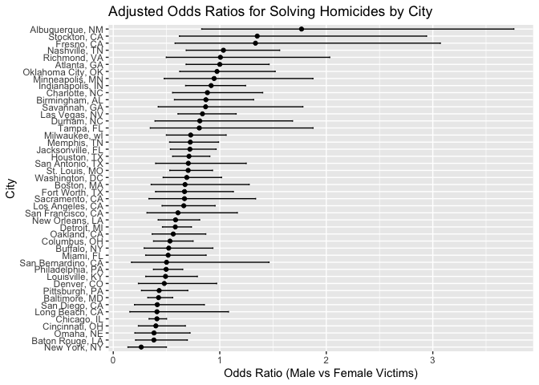

p8105_hw6_mt3857
================
Mengyao Tang
2024-11-22

``` r
library(tidyverse)
```

    ## ── Attaching core tidyverse packages ──────────────────────── tidyverse 2.0.0 ──
    ## ✔ dplyr     1.1.4     ✔ readr     2.1.4
    ## ✔ forcats   1.0.0     ✔ stringr   1.5.0
    ## ✔ ggplot2   3.5.1     ✔ tibble    3.2.1
    ## ✔ lubridate 1.9.2     ✔ tidyr     1.3.0
    ## ✔ purrr     1.0.1     
    ## ── Conflicts ────────────────────────────────────────── tidyverse_conflicts() ──
    ## ✖ dplyr::filter() masks stats::filter()
    ## ✖ dplyr::lag()    masks stats::lag()
    ## ℹ Use the conflicted package (<http://conflicted.r-lib.org/>) to force all conflicts to become errors

``` r
library(modelr)
library(broom)
```

    ## 
    ## Attaching package: 'broom'
    ## 
    ## The following object is masked from 'package:modelr':
    ## 
    ##     bootstrap

``` r
weather_df = 
  rnoaa::meteo_pull_monitors(
    c("USW00094728"),
    var = c("PRCP", "TMIN", "TMAX"),
    date_min = "2017-01-01",
    date_max = "2017-12-31"
  ) %>%
  mutate(
    name = recode(id, USW00094728 = "CentralPark_NY"),
    tmin = tmin / 10,
    tmax = tmax / 10
  ) %>%
  select(name, id, everything())
```

    ## using cached file: /Users/wan/Library/Caches/org.R-project.R/R/rnoaa/noaa_ghcnd/USW00094728.dly
    ## date created (size, mb): 2024-11-22 13:00:10 (8.667)
    ## file min/max dates: 1869-01-01 / 2024-11-30

``` r
boot_sample = function(df) {
  sample_frac(df, replace = TRUE)
}
boot_straps = 
  tibble(strap_number = 1:5000) %>% 
  mutate(strap_sample = map(strap_number, ~boot_sample(weather_df)))
bootstrap_results = 
  boot_straps %>% 
  mutate(
    models = map(strap_sample, ~lm(tmax ~ tmin, data = .x)),
    r_squared = map_dbl(models, ~glance(.x)$r.squared),
    log_product = map_dbl(models, ~{
      coef_estimates = coef(.x)
      log(coef_estimates[1] * coef_estimates[2])
    })
  )

bootstrap_results %>%
  ggplot(aes(x = r_squared)) +
  geom_density(fill = "blue", alpha = 0.5) +
  labs(title = "Distribution of R Squared from Bootstrap Samples", x = "R Squared", y = "Density")
```

<!-- -->

``` r
bootstrap_results %>%
  ggplot(aes(x = log_product)) +
  geom_density(fill = "green", alpha = 0.5) +
  labs(title = "Distribution of log(Beta0 * Beta1) from Bootstrap Samples", x = "log(Beta0 * Beta1)", y = "Density")
```

<!-- -->

``` r
r_squared_ci = quantile(bootstrap_results$r_squared, c(0.025, 0.975))
log_product_ci = quantile(bootstrap_results$log_product, c(0.025, 0.975))

r_squared_ci
```

    ##      2.5%     97.5% 
    ## 0.8936246 0.9277005

``` r
log_product_ci
```

    ##     2.5%    97.5% 
    ## 1.964234 2.057635

## problem 1

1.  R Squared Distribution The density plot for the R squared values
    obtained from 5000 bootstrap samples shows a skewed distribution
    with most values lying between approximately 0.88 and 0.94. The 95%
    confidence interval for R squared ranges from 0.894 to 0.927. This
    indicates the proportion of the variance in maximum temperature
    (tmax) explained by the minimum temperature (tmin). Given the narrow
    interval, we can infer that tmin has a consistent predictive
    relationship with tmax.

2.  Log Product of Beta0 and Beta1 The density plot for log(Beta0 \*
    Beta1) obtained from the bootstrap samples shows a roughly
    bell-shaped distribution, with values mostly concentrated between
    approximately 1.95 and 2.10. The 95% confidence interval for
    log(Beta0 \* Beta1) is between 1.965 and 2.059. This suggests that
    the product of the intercept (Beta0) and the slope (Beta1) is
    relatively stable across bootstrap samples, with a consistent
    positive log-transformed value.

Conclusion: The bootstrap analysis helped assess the stability of these
parameter estimates by providing an empirical distribution. From the
confidence intervals derived, it is evident that both the R squared and
log(Beta0 \* Beta1) have reasonably narrow intervals, suggesting
consistent relationships between the variables in the model. This
provides confidence in the reliability of these estimates for predicting
tmax based on tmin.

``` r
library(tidyverse)
library(broom)
library(purrr)

# Load the homicide data
homicide_data <- read_csv("/Users/wan/Downloads/homicide-data.csv")
```

    ## Rows: 52179 Columns: 12
    ## ── Column specification ────────────────────────────────────────────────────────
    ## Delimiter: ","
    ## chr (9): uid, victim_last, victim_first, victim_race, victim_age, victim_sex...
    ## dbl (3): reported_date, lat, lon
    ## 
    ## ℹ Use `spec()` to retrieve the full column specification for this data.
    ## ℹ Specify the column types or set `show_col_types = FALSE` to quiet this message.

``` r
# Data cleaning: filter out specific cities and ensure victim_age is numeric
cleaned_data <- homicide_data %>%
  filter(
    !city %in% c("Dallas", "Phoenix", "Kansas City", "Tulsa"),
    victim_race %in% c("White", "Black")
  ) %>%
  mutate(
    victim_age = as.numeric(victim_age),
    city_state = paste(city, state, sep = ", "),
    resolved = as.numeric(disposition == "Closed by arrest")
  )
```

    ## Warning: There was 1 warning in `mutate()`.
    ## ℹ In argument: `victim_age = as.numeric(victim_age)`.
    ## Caused by warning:
    ## ! NAs introduced by coercion

``` r
# Filter data for Baltimore, MD
baltimore_data <- cleaned_data %>%
  filter(city_state == "Baltimore, MD")

# Fit logistic regression model for Baltimore, MD
baltimore_model <- glm(resolved ~ victim_age + victim_sex + victim_race, data = baltimore_data, family = binomial())

# Get adjusted odds ratio for male vs female victims
baltimore_results <- baltimore_model %>%
  tidy() %>%
  filter(term == "victim_sexMale") %>%
  mutate(OR = exp(estimate),
         CI_low = exp(estimate - 1.96 * std.error),
         CI_high = exp(estimate + 1.96 * std.error))

# Print results for Baltimore
baltimore_results
```

    ## # A tibble: 1 × 8
    ##   term           estimate std.error statistic  p.value    OR CI_low CI_high
    ##   <chr>             <dbl>     <dbl>     <dbl>    <dbl> <dbl>  <dbl>   <dbl>
    ## 1 victim_sexMale   -0.854     0.138     -6.18 6.26e-10 0.426  0.325   0.558

``` r
# Fit logistic regression for each city and extract adjusted odds ratios
city_models <- cleaned_data %>%
  group_by(city_state) %>%
  nest() %>%
  mutate(
    model = map(data, ~glm(resolved ~ victim_age + victim_sex + victim_race, data = ., family = binomial())),
    results = map(model, ~tidy(.) %>% filter(term == "victim_sexMale") %>% mutate(OR = exp(estimate), CI_low = exp(estimate - 1.96 * std.error), CI_high = exp(estimate + 1.96 * std.error)))
  ) %>%
  unnest(results) %>%
  select(city_state, OR, CI_low, CI_high)

# Plot the estimated odds ratios with confidence intervals
city_models %>%
  ggplot(aes(x = reorder(city_state, OR), y = OR)) +
  geom_point() +
  geom_errorbar(aes(ymin = CI_low, ymax = CI_high), width = 0.2) +
  coord_flip() +
  labs(title = "Adjusted Odds Ratios for Solving Homicides by City",
       x = "City",
       y = "Odds Ratio (Male vs Female Victims)")
```

<!-- --> \## problem2
The plot shows the estimated odds ratios (OR) for solving homicides
comparing male victims to female victims across different cities, along
with the corresponding confidence intervals (CIs). Cities are organized
by their estimated OR values, making it easier to see which cities have
higher or lower odds of solving cases involving male victims compared to
female victims.

Most of the cities have OR values below 1, indicating that homicides
involving male victims are generally less likely to be resolved compared
to those involving female victims. The confidence intervals for several
cities overlap with 1, suggesting no statistically significant
difference between the odds of solving cases involving male and female
victims for those cities.

``` r
library(tidyverse)
library(broom)
library(modelr)

# Load the dataset
birthweight_data <- read_csv("/Users/wan/Downloads/birthweight.csv")
```

    ## Rows: 4342 Columns: 20
    ## ── Column specification ────────────────────────────────────────────────────────
    ## Delimiter: ","
    ## dbl (20): babysex, bhead, blength, bwt, delwt, fincome, frace, gaweeks, malf...
    ## 
    ## ℹ Use `spec()` to retrieve the full column specification for this data.
    ## ℹ Specify the column types or set `show_col_types = FALSE` to quiet this message.

``` r
# Clean the data
cleaned_birthweight_data <- birthweight_data %>%
  mutate(
    babysex = as.factor(babysex),
    frace = as.factor(frace),
    mrace = as.factor(mrace),
    malform = as.factor(malform),
    gaweeks = as.integer(gaweeks),
    ppbmi = as.numeric(ppbmi),
    delwt = as.numeric(delwt),
    fincome = as.numeric(fincome)
  ) %>%
  drop_na()

# Fit the initial regression model for birthweight
birthweight_model <- lm(bwt ~ blength + bhead + wtgain + momage + smoken + fincome, data = cleaned_birthweight_data)

# Add predictions and residuals to the dataset
model_data <- cleaned_birthweight_data %>%
  add_predictions(birthweight_model) %>%
  add_residuals(birthweight_model)

# Plot residuals vs. fitted values
ggplot(model_data, aes(x = pred, y = resid)) +
  geom_point(alpha = 0.5) +
  geom_hline(yintercept = 0, linetype = "dashed") +
  labs(title = "Residuals vs Fitted Values",
       x = "Fitted Values (Predicted Birthweight)",
       y = "Residuals")
```

<!-- -->

``` r
# Fit the other models
model_2 <- lm(bwt ~ blength + gaweeks, data = cleaned_birthweight_data)
model_3 <- lm(bwt ~ bhead * blength * babysex, data = cleaned_birthweight_data)

# Cross-validation
set.seed(123)
cv_data <- crossv_mc(cleaned_birthweight_data, 100)

# Fit models and calculate RMSE for each
cv_results <- cv_data %>%
  mutate(
    train = map(train, as_tibble),
    test = map(test, as_tibble),
    model_1 = map(train, ~lm(bwt ~ blength + bhead + wtgain + momage + smoken + fincome, data = .)),
    model_2 = map(train, ~lm(bwt ~ blength + gaweeks, data = .)),
    model_3 = map(train, ~lm(bwt ~ bhead * blength * babysex, data = .)),
    rmse_1 = map2_dbl(model_1, test, ~rmse(model = .x, data = .y)),
    rmse_2 = map2_dbl(model_2, test, ~rmse(model = .x, data = .y)),
    rmse_3 = map2_dbl(model_3, test, ~rmse(model = .x, data = .y))
  )

# Plot RMSE comparison
cv_results %>%
  select(starts_with("rmse")) %>%
  pivot_longer(cols = everything(), names_to = "model", values_to = "rmse") %>%
  ggplot(aes(x = model, y = rmse)) +
  geom_violin() +
  labs(title = "RMSE Comparison Across Models",
       x = "Model",
       y = "RMSE")
```

<!-- --> \## problem3
Model 1 (with multiple predictors) appears to have the best predictive
accuracy overall, with the lowest average RMSE, indicating that the
additional predictors (such as maternal smoking and income) provide
useful information for predicting birthweight. Model 2 is simpler but
still performs well, with RMSE values that are only slightly higher
compared to the other models. Its simplicity makes it a more
interpretable option if prediction accuracy is not significantly
compromised. Model 3, despite being more complex (with multiple
interactions), does not show a significant reduction in RMSE compared to
Model 1 and may be overfitting, especially given the increased
variability in RMSE values observed. In conclusion, Model 1 seems to
offer a good balance between predictive accuracy and the inclusion of
multiple relevant predictors, while Model 2 may be a better choice if
interpretability and simplicity are prioritized. Model 3 does not appear
to add enough value to justify the increased complexity and risk of
overfitting.
